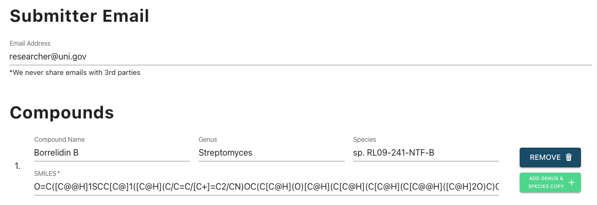
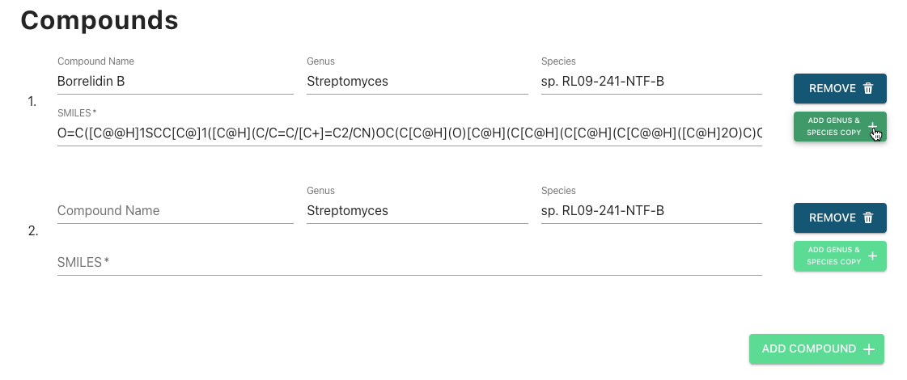
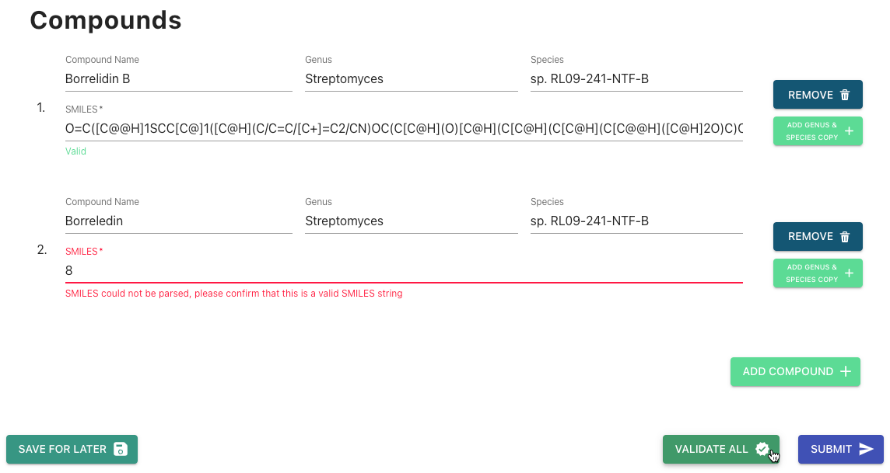
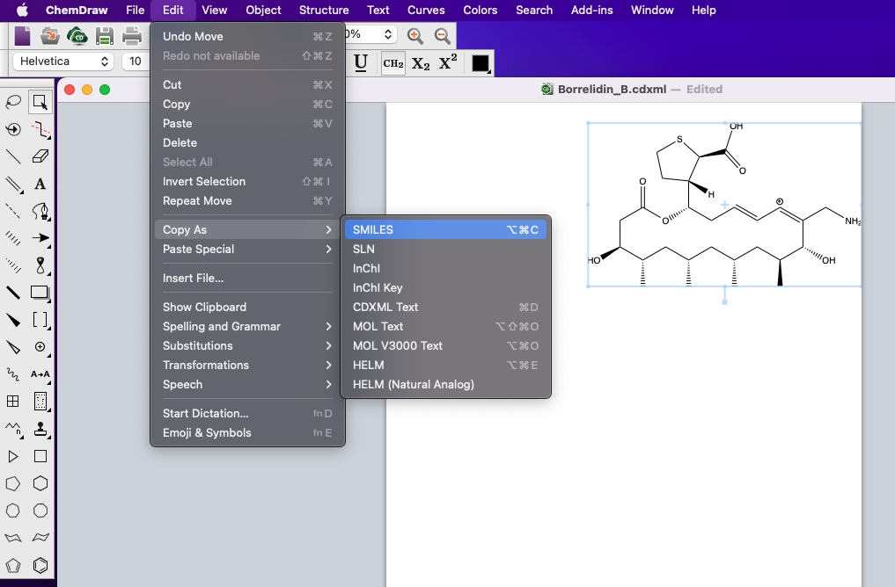
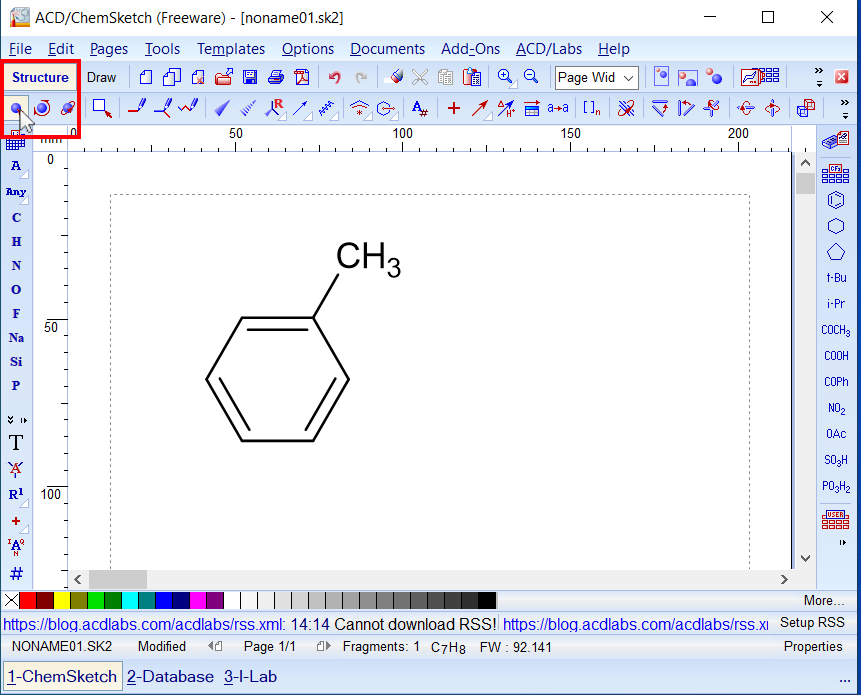
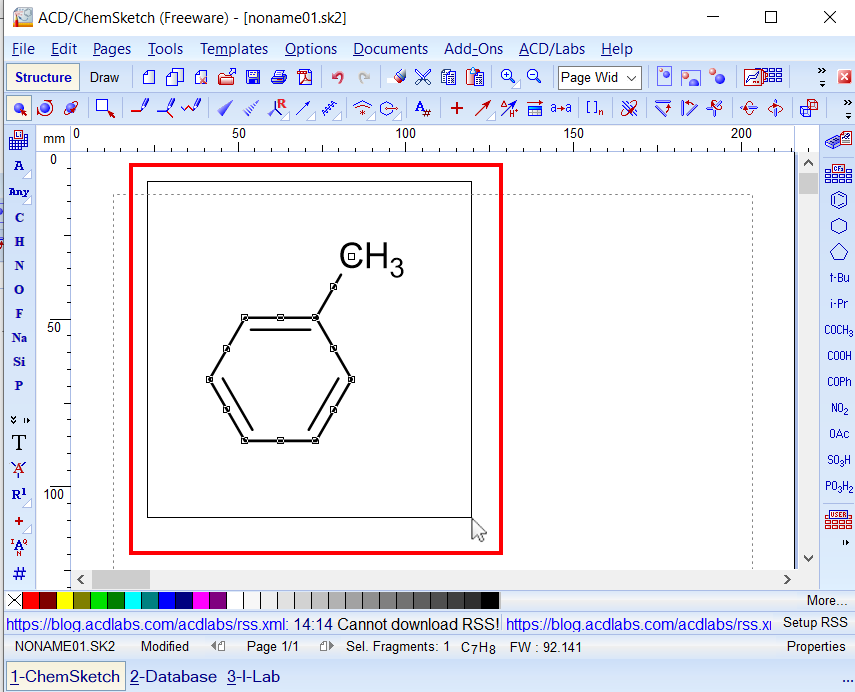
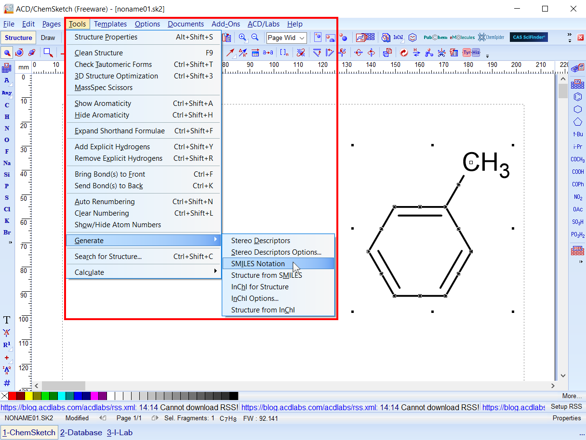

# Step 2: Compound Deposition

[The Compound Information Form](#the-compound-information-form)
* [Filling Information](#filling-information)
* [Validating](#validating)
* [Submitting](#submitting)

[Troubleshooting and Additional Help](#troubleshooting-and-additional-help) 

* [Getting SMILES strings for your compounds](#getting-smiles-strings-for-your-compounds)
  * [Generating SMILES Strings in ChemDraw](#generating-smiles-strings-in-chemdraw)
  * [Generating SMILES Strings in ChemSketch Freeware](#generating-smiles-strings-in-chemsketch-freeware) 
* [Error: SMILEs String is Invalid](#error-smiles-string-is-invalid)

# The Compound Information Form
This is the first step in the deposition process for depositors with published or unpublished articles. On this page you will be prompted to enter information about the compounds you are depositing (Compound Name, Genus, Species, and Canonical SMILES). If you are submitting compounds from a published paper our system will attempt to automatically pre-fill compound info for you if it is able to extract it from your paper's abstract (this currently works ~50% of the time).

## *Filling Information*

- Submitter Email is the email address that will be used to contact users regarding updates to their deposition. This field is optional if you are submitting compounds from a published article but not from a presubmissions. Note that we never share email information with any 3rd parties.
- Compound Name, Genus, and Species are optional for each compound. If you do not submit this information it will not be displayed on your NP-Card when it is published.

  

- All compounds discovered in your article must be submitted at once.
- Clicking *Add Compound* will add a new <u>blank</u> compound box to your submission.
- Clicking *Add Genus & Species Copy* will add a new compound with the genus/species information copied from the associated compound.
- Clicking *Remove* will remove the associated compound from your submission.
- A SMILES string is *required* for each compound.
- Two or more compounds <u>cannot share the same SMILES string</u>. If your submission requires you to submit two compounds with the same SMILES strings please contact us directly (support@npmrd-deposition.org) or consider using one of our alternative deposition methods (https://np-mrd.org/submissions).

  

## *Validating*

- Clicking *Validate All* will cause our system to check if your information is valid. Any invalid compounds will have an associated error message displayed.
- Validation is automatically run on all compounds upon submission.

  

## *Submitting*
Once the compound info is filled simply click *Submit* to proceed to the next step in the deposition process.

- Any entered information will be saved in our servers. If there are any validation errors you cannot submit until they are resolved.
- Compound Information may be resubmitted as many times as the user wishes
- You cannot resubmit compound information once you have uploaded NMR data for your submission. If you wish to re-start your submission please send us an email (support@npmrd-deposition.org). 

  

# Troubleshooting and Additional Help

## *Getting SMILES strings for your compounds*

### Generating SMILES Strings in ChemDraw

The easiest way to generate SMILES strings for compounds is by using <a href="https://perkinelmerinformatics.com/products/research/chemdraw" target="_blank" >*ChemDraw*</a>.  

1. Open or re-create your molecule in ChemDraw.
2. Select your *entire* compound using one of the selection tools (i.e. lasso, marquee, etc.) You'll know your compound has been selected if it has a box around it like the image bellow. Please ensure you have <u>only selected the one compound</u> which you will be getting a SMILES string for.
3. In the ChemDraw toolbar at the top of your screen select Edit → Copy As → SMILES
4. The compound's Canonical SMILES, such as "CC1CC(=O)C=C(C12C(=O)C3=C(O2)C(=C(C=C3OC)OC)Cl)OC",  will be copied to your clipboard and can now be pasted into the SMILES textbox.

### Generating SMILES Strings in ChemSketch Freeware

If you use ChemSketch instead then you can generate a SMILEs string for your compound by doing the following...  

1. Open or re-create your molecule in ChemSketch.
2. Under the "Structure" tab click "Select" to activate the selection tool.

3. Select your *entire* compound using one of the selection tools (i.e. lasso, marquee, etc.) You'll know your compound has been selected if it has a box around it like the image bellow. Please ensure you have <u>only selected the one compound</u> which you will be getting a SMILES string for.

4. In the ChemSketch toolbar at the top of your screen select Tools → Generate → SMILES Notation

5. The compound's Canonical SMILES, such as "CC1CC(=O)C=C(C12C(=O)C3=C(O2)C(=C(C=C3OC)OC)Cl)OC",  will be copied to your clipboard and can now be pasted into the SMILES textbox.

## *Error: SMILES String is Invalid*
This message indicates that the SMILES you have entered is not a valid SMILES string.

**Potential solutions:**

1. Check for (and delete) any non SMILES-valid characters in your strings. For more information on which characters are valid in canonical SMILES please <a href="https://en.wikipedia.org/wiki/Simplified_molecular-input_line-entry_system#Description" target="_blank" >*click here*</a>.  
2. If the above doesn't do the trick, you can always re-create your SMILES using ChemDraw.
3. Email us at support@npmrd-deposition.org.
