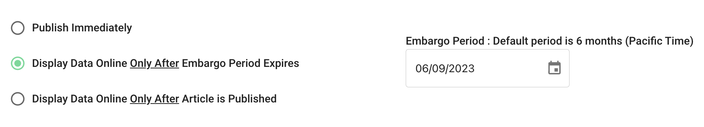
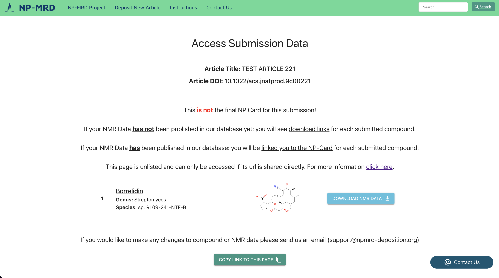
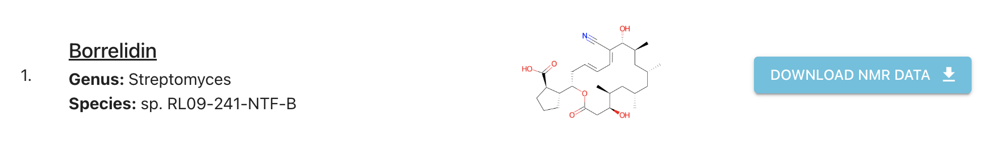
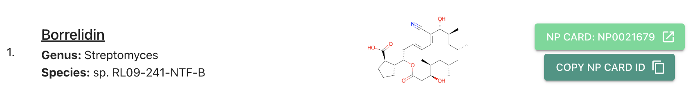
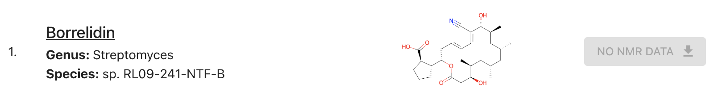

# Data Publishing and Sharing

[Publishing Data in the Database](#publishing-data-in-the-database)
  * [From Submission to NP Card](#from-submission-to-np-card)
  * [When Data Published in the Database](#when-data-published-in-the-database)
    + [When Data From a Published Article or Private Deposition Is Published](#when-data-from-a-published-article-or-private-deposition-is-published)
    + [When Data From a Presubmission Is Published](#when-data-from-a-presubmission-is-published)
      - [Publish Immediately](#publish-immediately)
      - [Display Only After Embargo Period Ends](#display-only-after-embargo-period-ends)
        - [Changing Your Embargo Date](#changing-your-embargo-date)
      - [Display Only After Article Is Published](#display-only-after-article-is-published)
  * [How Do I Know When My Data Has Gone Live?](#how-do-i-know-when-my-data-has-gone-live)
  * [I Can’t Find My Data in the Search or Browse Tabs](#i-can-t-find-my-data-in-the-search-or-browse-tabs)

[Downloading and Sharing NMR Data - The Access Submission Data Page](#downloading-and-sharing-nmr-data---the-access-submission-data-page)
  * [How the Access Submission Data Page Works](#how-the-access-submission-data-page-works)
  * [Getting to the Access Submission Data Page](#getting-to-the-access-submission-data-page)
  * [Using the Access Submission Data Page](#using-the-access-submission-data-page)
    + [If Your Data is Not Live in the Database Yet](#if-your-data-is-not-live-in-the-database-yet)
    + [If Your Data is Live in Our Database](#if-your-data-is-live-in-our-database)
    + [If Your Submission Did Not Include NMR Data](#if-your-submission-did-not-include-nmr-data)
  * [Changing Your Access Submission Data Link](#changing-your-access-submission-data-link)

# Publishing Data in the Database

## From Submission to NP Card

- Submissions often include multiple compounds that were discovered and put through the drag-and-drop system together. Completed submissions will be have each of their compounds published as a separate NP-Card on https://np-mrd.org/.

- We recommend the following format for displaying your NP-MRD IDs in the data availability statement of publications:

  "The NMR data for compounds 1-4 have been deposited in the Natural Products Magnetic Resonance Database (<a href="np-mrd.org/">np-mrd.org</a>) under accession numbers NP0331529, NP0017652, NP0017654, NP0331530."

## When Data Published in the Database

- New data is published and made live on the website within 24 hours of it being set to be released. Release date can vary depending on what kind of submission has been completed.

- If you wish to share your data before it is published considering using the [Access Submission Data Page](#downloading-and-sharing-nmr-data---the-access-submission-data-page)

### When Data From a Published Article or Private Deposition Is Published

- Data submitted for a published article will be published as soon as possible following completion of the submission.

### When Data From a Presubmission Is Published

- When starting a presubmission or private deposition you can choose from three different release conditions. <u>These options control when your deposition will show up in the np-mrd.org database</u>. The Options are as follows...

* #### Publish Immediately

    - If this option is selected then data from the submission will be published as soon as possible following the completion of your submission. This typically occurs within 24 hours.

* #### Display Only After Embargo Period Ends

    - If this option is selected then data from the submission will be published as soon as possible following the passing of the specified embargo date.
    - Note that this release date adhears to PST or UTC -8 and depositions may take up to 24 hours to appear in the database following the passing of your embargo date.

    - #### Changing Your Embargo Date
    
        - Upon completion of your submission you will receive a confirmation email containing various links. If you have set an embargo date then a link to a page that will allow you to alter your embargo date will be included in this email. If you no longer have access to this email and would like to change your embargo date please contact us at support@npmrd-deposition.org.

* #### Display Only After Article Is Published

    - If this option is selected then data from the submission will not be published in the np-mrd database until the DOI of the article it is associated with has been submitted to or automatically ingested by our system.
    - Due to various difficulties associated with automatically attaching a DOI to presubmission there is no guarantee that our system will  If you wish to manually support (the link for this can be found in the your "deposition complete" email).

## How Do I Know When My Data Has Gone Live?

- When your submitted compounds have been fully processed and are live in the database you will receive an email containing a list of the NP-Card IDs (the ID values used on <a href="np-mrd.org/">np-mrd.org</a>) that have been assigned to each of the compounds you have deposited.

## I Can’t Find My Data in the Search or Browse Tabs

- Even after your data has been published it will not initially appear in the browse or search systems of the database website. It may take up to 1 week for it to be discoverable through these means. You will be emailed links to the NP-Card(s) of your deposited compound(s) so if you wish to share your data in the meantime please use these directly.

 

# Downloading and Sharing NMR Data - The Access Submission Data Page

## How the Access Submission Data Page Works

- This page can be accessed for any completed submission. Its purpose is to act as a single source to distribute or view submitted NMR data.

## Getting to the Access Submission Data Page

- The "Access Submission Data" page is linked to upon completion of a submission. It is also linked to in all "deposition complete" emails sent to depositors upon finishing a submission. If you have lost or deleted this email and wish to access this page please contact us (support@npmrd-deposition.org).

- This page is unlisted for every submission and can only be accessed via its link. A unique identifier (separate from the)  <u>**Anyone with this link can download ALL of the NMR Data included in your submission**</u> so please do not share it with anyone with whom you do not wish to share this data with.

- If you wish to keep your data completely private prior to its publication in our database please do not share this link with anyone.

## Using the Access Submission Data Page

- On this page all compound(s) included in your submission are listed showing their name, genus, species, and structure. You can copy a link to this page to your clipboard using the "copy link to this page" button. Additionally, there will be either a download button or link provided for each compound.

### If Your Data is Not Live in the Database Yet

- If your data is not yet live in our database you will be provided with download links directly to the NMR data submitted. Links are provided on a compound-by-compound basis and will return a zip file of the unaltered files as they were submitted to the system.

- Please note that if you progress to this page immediately after completing your submission we may still be processing your data and will not be able to provide you with download links. If this problem persists for multiple hours following the completion of your submission please contact us directly (support@npmrd-deposition.org)

### If Your Data is Live in Our Database

- If your data is live in our database you will be provided with links to the NP card for each compound. These will open to a new tab and allow you to access all of your submitted and utilize all of the features that NP-MRD has to offer!

### If Your Submission Did Not Include NMR Data

- If you did not include NMR data in your submission <u>AND it has not gone live in our database yet</u> then we will not be able to provide you with a download link.

