# Step 3: NMR Data Drag & Drop

[Preparing Your Data For Upload](#preparing-your-data-for-upload)
1. [What Kind of Data Can I Deposit?](#1-what-kind-of-data-can-i-deposit)
2. [Folder Structure](#2-folder-structure)
    - [Bruker](#bruker)
    - [Varian](#varian)
    - [Jeol](#jeol)
    - [Formats That Require Additional Preparation](#formats-that-require-additional-preparation)
        - [.jdf](#jdf)
        - [.mnova](#mnova)
        - [.nmrML](#nmrml)
    - [Converting From Unsupported Formats](#converting-from-unsupported-formats)
3. [Zipping your data](#3-zipping-your-data)

[Using The Drag & Drop Interface](#using-the-drag--drop-interface)
1. [Depositing NMR Data](#1-depositing-nmr-data)
2. [Removing Uploaded NMR Files](#2-removing-uploaded-nmr-files)
3. [Removing Compounds](#3-removing-compounds)
4. [Validating](#4-validating)
5. [Submitting](#6-submitting)

[Troubleshooting and Additional Help](#troubleshooting-and-additional-help) 
- [Error: Only Varian, JEOL, Bruker files are accepted](#error-only-varian-jeol-bruker-files-are-accepted)
- [Error: Fid file is missing](#error-fid-file-missing-or-in-invalid-location)
- [Error: Ensure that the submission does not include nested zip file](#error-ensure-that-the-submission-does-not-include-nested-zip-file)

# Preparing Your Data For Upload

## *1) What Kind of Data Can I Deposit?*

NP-MRD is a database for the deposition and display of Nuclear Magnetic Resonance Data. In order to standardize how data is processed and presented we ask that users deposit their <u>original, unprocessed data generated directly by their NMR machines</u>. Processed NMR data may also optionally be included the same zip folder as the original data.

In order to upload data to this platform NMR files containing experimental data must be organized in a standardized folder structure (which varies depending on the manufacturer of your NMR machine) and be compressed into a single archive format file (.zip, .rar, .7z, etc.).

The Drag & Drop interface accepts NMR data on a <u>compound by compound</u> basis, meaning that each compound you submit data for must be uploaded in its own zip file which contains data for <u>each of the NMR experiments performed on that compound</u>. 

## *2) Folder Structure*
When uploading data for a <u>single compound</u> please adhere to the following instructions.

- The system accepts one zip file per compound
- All experimental NMR data adhering to one compound must be placed in the same folder and then zipped together
- The system is able to detect the solvent used in each experiment, so if you performed the same experiment in multiple different solvents please upload the files for each in the same (compound-specific) zip file
- The system checks for the files generated directly by your NMR instrument, any additional data (i.e. processed data) may be optionally included on an experiment-by-experiment basis

Below are examples of the directory structure required for uploading data belonging to a single compound.

### **Bruker**
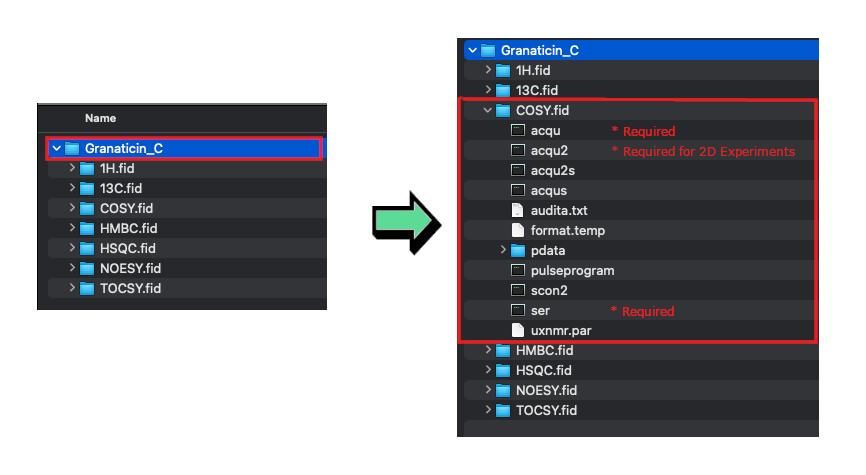

### **Varian**
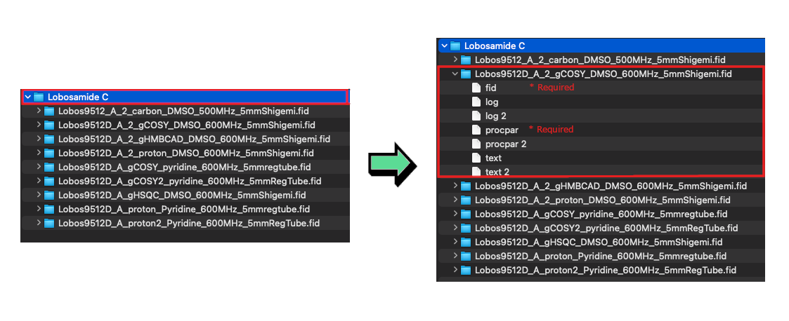

### **JEOL**
Our system is currently only designed to accept .jdx files and currently not support the upload of .jdf files directly. [In order to upload data stored in .jdf files they must first be converted to a .jdx file](#jdf). The processing of .jdx files takes longer than other formats so please be patient when uploading.

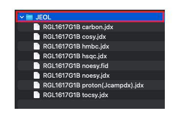

  

## *Formats That Require Additional Preparation*

Some NMR formats are cannot currently be read directly by our system but can be submitted by first being converted to a supported format. 

### **.jdf**

.jdf files cannot be read directly by our system, however, they can be converted to .jdx files (which are readable by our system) through one of a number of methods...

*Potential solutions:*

1. Convert the file to a .jdx format using <a href="https://www.jeolusa.com/PRODUCTS/Nuclear-Magnetic-Resonance/Delta-NMR-Software" target="_blank" >*JEOL Delta software*</a>.
2. [Convert your .jdf files to a .jdx file using MesReNova](#converting-to-jdx-using-mestrenova)

### **.mnova**
Because our system is designed for to accept original, unprocessed NMR data. As such, .mnova files cannot be accepted directly.

*Potential solutions:*

1. Zip the raw data folder instead. If available, raw data folders must include parameter and fid files.
2. [Convert your .mnova file to a .jdx file using MesReNova](#converting-to-jdx-using-mestrenova)

### **.nmrML**

*Potential solutions:*

1. Zip the raw data folder instead. If available try zipping the raw data folders that include parameter and fid files.
2. Email us at support@npmrd-deposition.org.

  

## *Converting From Unsupported Formats*

### **Converting To .jdx Using MestReNova**
Some formats (.jdf, .mnova) cannot be processed by our system but can be converted to a .jdx file which is accepted. If your NMR data files require conversion please follow these steps...

- **IF CONVERTING FROM .jdf**: Each .jdf file contains only a single experiment so you must first open all files in a one Mnova instance. You can do this by selecting all of your files and dragging them into an empty MestReNova window.
- **IF CONVERTING FROM .mnova**: Open your .mnova file in a MestReNova window.
- Select all of your experiments at once. You can do this by clicking the 
and then export them all into one .jdx file by right clicking Pages tab and then clicking on "Select All".
- Ensure that all of your experiments are still selected. Then export a .jdx by clicking File -> Save As and selecting JCAMP-DX as the file export type.

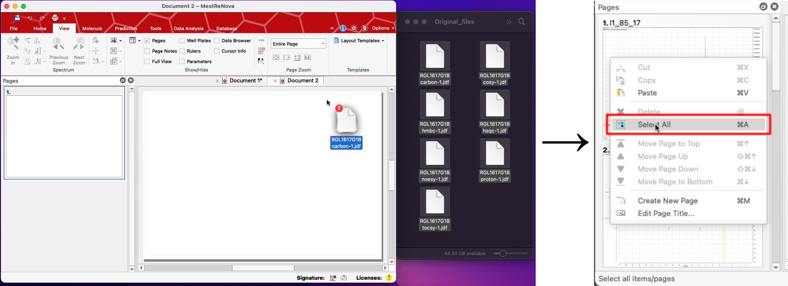
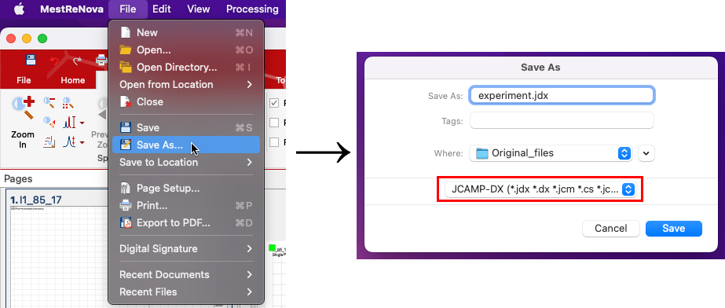

  

## *3) Zipping your data*
Once you have confirmed the data is in the correct file structure, each folder must be zipped separately. This means that if you have three compounds you should zip each of them to produce three separate zip folders. For instruction on how to zip your compound folders for each operating system see below:

#### **Windows 10**
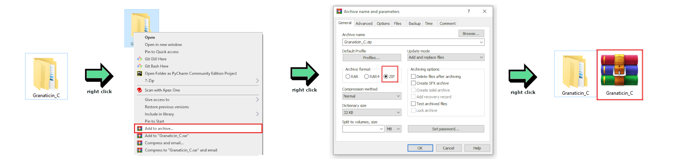

#### **Windows 11**
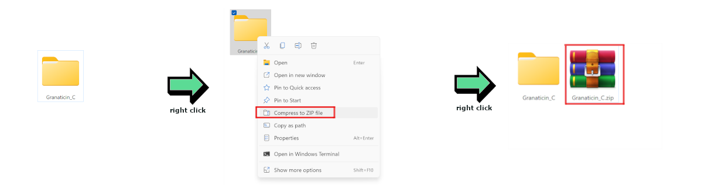

#### **MacOS**
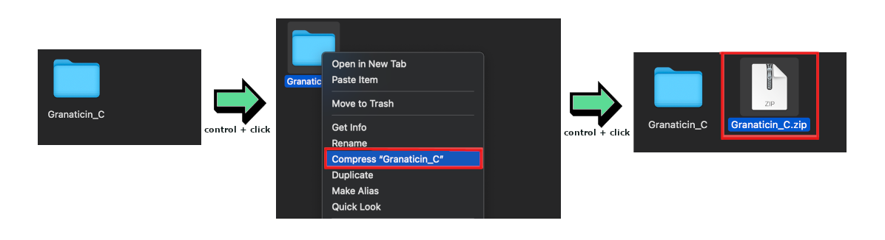

# Using The Drag & Drop Interface

## *1) Depositing NMR Data*
On the NMR Drag & Drop page you will see the compound info you entered paired and a deposition box.

Once your NMR files are properly prepared and zipped you may begin uploading them.
* Drag and drop your prepared raw data zips into the corresponding boxes. (You may also click on the box to bring up the file explorer.)

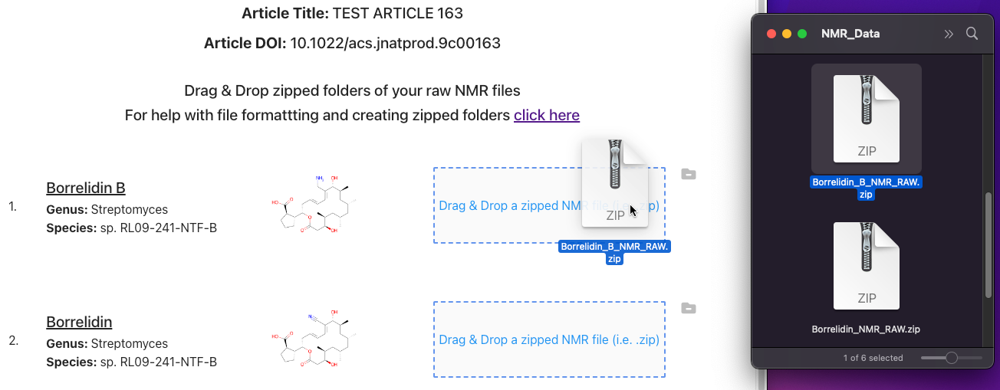

* Wait for the upload and check that no errors were presented
* If upload and processing is successful, the system will provide you a list of detected experiments

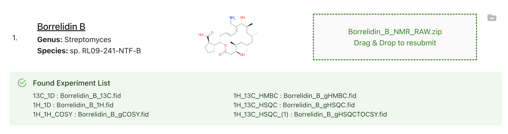

* Uploaded files will persist in a temporary cache our system until submitted. Unsubmitted files will be cleaned from our system approximately 6 hours from initial drag & drop. If you do not submit in this time you must re-upload all your NMR data.

## *2) Removing Uploaded NMR Files*

* If you wish to remove a file that you have uploaded you can either click the remove file button (the file with the minus) or simply drag & drop another file overtop of the box to upload it instead

    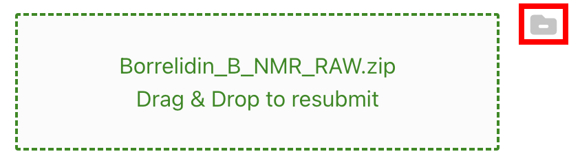

## *3) Removing Compounds*

* If you've realized that you do not have the data for one of your compounds you may click "Back" to return to compound info submission page, remove the compound, and then resubmit your compound info to return to the drag & drop page. Files you've already uploaded for other compounds will not disappear if you go to another page.

## *4) Validating*

* Clicking "Validate All" will cause our system to check and inform you if your NMR data is ready to be submitted.

## *5) Submitting*

* All compounds must have valid NMR files uploaded in order to submit
* Submitting will cause all uploaded files to be properly saved and stored in our system
* Once you've submitted NMR data you may no longer alter your compound information or re-upload your NMR data so please double check before submitting

# Troubleshooting and Additional Help

## *Error: Only Varian, JEOL, Bruker files are accepted*
This is indicating that the webpage has not found NMR Data produced by one of the three manufacturers (Varian, JEOL, Bruker) in your zip file. 

**Potential solutions:**

1. Check your zip file to make sure that is really is NMR data. Have you zipped the wrong folder? Are there files missing?
2. Check to make sure that your NMR folders have parameter files in them. These files are labelled "procpar" for Varian data and "acqu/acqus" for Bruker data.
3. Email us at support@npmrd-deposition.org.

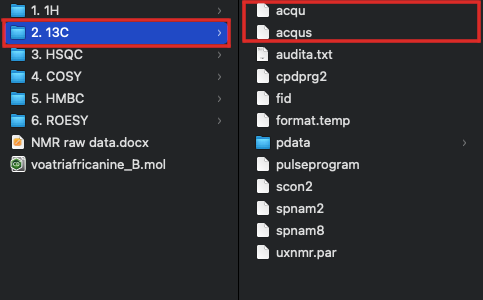

  

## *Error: Fid file missing or in invalid location*
This indicates that there is a missing fid file from one of your experiments. Without this fid file we can not accept the data your are depositing.

**Potential solutions:**

1. Make sure that each experiment in the affected zip folder has a fid file or raw data file of some sort.
2. Email us at support@npmrd-deposition.org.

  

## *Error: Ensure that the submission does not include nested zip file*
This error is letting you know that the zip file you submitted contains other compressed files within it. In other words, you have a zip file inside of a zip file. 

**Potential solutions:**

1. Unzip the nested file. If you have zipped files inside of the larger zip file, open up that zip file and unzip all the files inside. Once this is done you should be able to rezip the larger file and deposit successfully.
2. Email us at support@npmrd-deposition.org.
